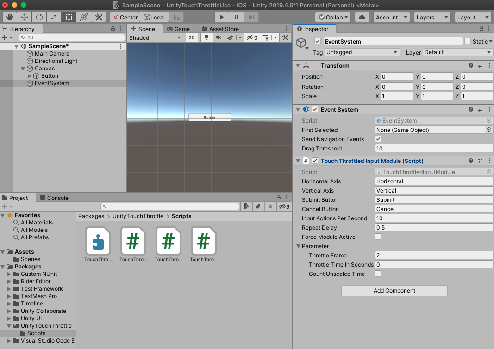

# UnityTouchThrottle
Touch throttled input module for Unity

Pressing multiple buttons at the same time and button mashing can cause problems.

UnityTouchThrottle throttles touch pressed events by extending StandaloneInputModule.

Throttling mouse click events are not supported now.

# Install

You can add `https://github.com/doyasu24/UnityTouchThrottle.git?path=Assets/Plugins/TouchThrottle#v0.1.3` to Package Manager

or import unitypackage from [release page](https://github.com/doyasu24/UnityTouchThrottle/releases).

# How to use

Generate a default `EventSystem` and add `TouchThrottledInputModule` component instead of `StandaloneInputModule`.

# License

MIT License
