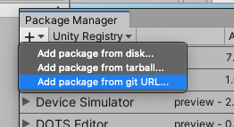
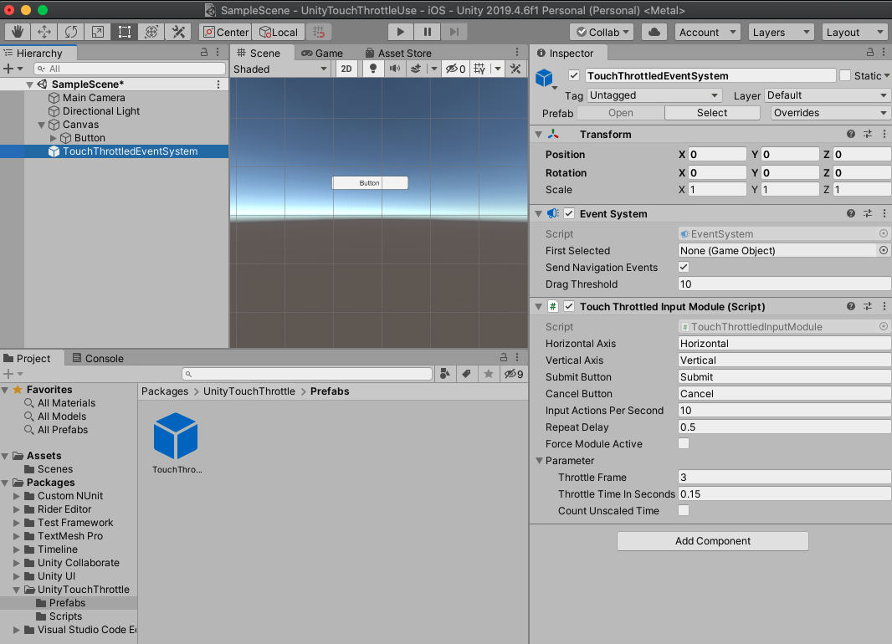

# UnityTouchThrottle
Touch throttled input module for Unity

Pressing multiple buttons at the same time and button mashing can cause problems.

UnityTouchThrottle throttles touch pressed events by extending StandaloneInputModule.

Throttling mouse click events are not supported now.

# Install

## Install via git URL

In Unity 2019.4 or later, you can add `https://github.com/kado-yasuyuki/UnityTouchThrottle.git?path=Assets/Plugins/TouchThrottle` to Package Manager

or add `"com.dys.unitytouchthrottle": "https://github.com/kado-yasuyuki/UnityTouchThrottle.git?path=Assets/Plugins/TouchThrottle"` to Packages/manifest.json.

## Install via unitypackage

import UnityTouchThrottle unitypackage from release page.

# How to use

use `TouchThrottledEventSystem` prefab instead of default `EventSystem`

or generate a default `EventSystem` and add `TouchThrottledInputModule` component instead of `StandaloneInputModule`.

# License

MIT License
